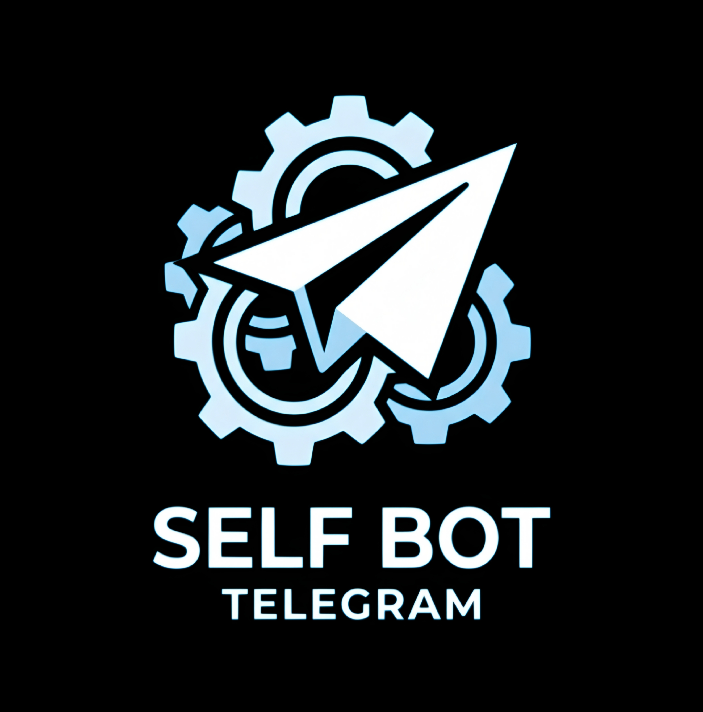

<p align="center">
  
</p>

<h1 align="center">Telegram Self Bot</h1>

<p align="center">
  A Telethon-based Telegram self-bot with a built-in Flask keepalive server, ready to deploy on Render.
</p>

> **Note:** Automating a personal Telegram account like this is against Telegram's Terms of Service and can get an account limited or banned, especially the broadcast command. Use responsibly and at your own risk.

## Commands

| Command | Usage |
|---|---|
| `.dm <text>` | Reply to a user's message to DM them |
| `.block` | Reply to a user's message to block them |
| `.fd <username>` | Reply to a message to forward it to a user |
| `.fdc <link>` | Reply to a message to forward it to a channel/group |
| `.bdc` | Reply to a message, then `.bdc confirm` to broadcast it to every group/channel you're in |
| `.leave` | Leave the current group/channel |
| `.del` | Delete the full chat (private) or a single message (group) for everyone |
| `.fix` | Reconnect the client and report the last error |

## Deploy to Render

1. Fork / push this repo to your own GitHub account.
2. On [Render](https://render.com), choose **New → Blueprint** and point it at your repo (`render.yaml` is already included, so the service, Python version, build command and start command are configured automatically).
3. Set the environment variables when prompted: `API_ID`, `API_HASH`, `SESSION_STRING`.
4. Deploy. Render will auto-redeploy on every push to your repo.
5. The app listens on port `8080` and exposes `/` and `/health`, so you can point a Better Stack heartbeat/uptime monitor at your Render URL to keep it alive 24/7.

## Getting your session string

Render can't do an interactive phone/code login, so generate a `SESSION_STRING` locally first:

```bash
pip install telethon
python get_session.py
```

Enter your `API_ID` and `API_HASH` (from [my.telegram.org](https://my.telegram.org)) when prompted, then log in with your phone number and code. Copy the printed string into the `SESSION_STRING` environment variable.

## Environment variables

| Variable | Description |
|---|---|
| `API_ID` | Telegram API ID from my.telegram.org |
| `API_HASH` | Telegram API hash from my.telegram.org |
| `SESSION_STRING` | Generated with `get_session.py` |
| `PORT` | Optional, defaults to `8080` |

## Local run

```bash
pip install -r requirements.txt
python main.py
```

---

<p align="center">
  <b>Credits: Aashu</b><br/><br/>
  <a href="https://t.me/outwiles">
    
  </a>
  <a href="https://github.com/outwiles">
    
  </a>
  <a href="mailto:outwiles@proton.me">
    
  </a>
</p>
